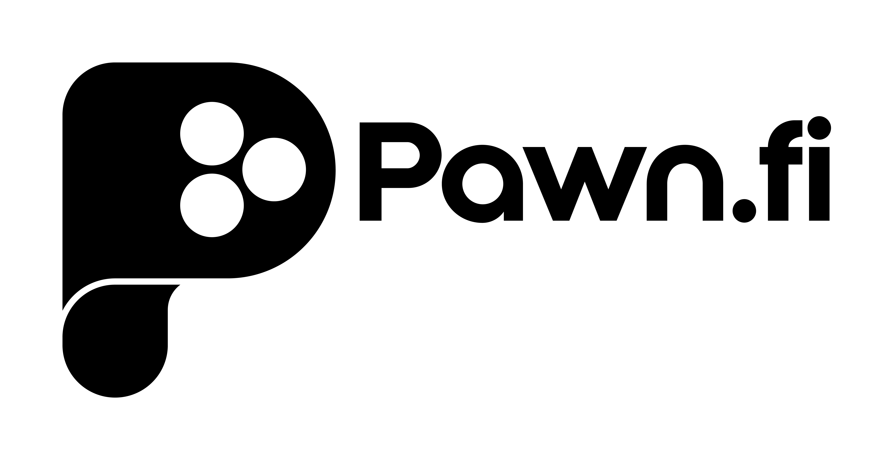

## 

---

Pawn.fi protocol facilitates trustless borrowing, lending, and escrow of NFT assets on the Ethereum blockchain.

## Overview

Pawn.fi builds infrastructure for NFT liquidity. We enable the financialization of non-fungible assets, commonly referred to as NFTs. They represent a natural evolution of storing value and attributing ownership for unique assets.

The Pawn.fi protocol facilitates trustless off-chain order matching using structured digital signatures to validate loan term attestations from borrowers and lenders. Loans are settled on-chain and held in decentralized escrow
, co-opting cryptographic security guarantees offered by Ethereum.

### Features

#### Asset Wrapping

wNFT (Wrapped NFT) - Deposit hybrid assets (ERC721, ERC1155, ERC20) minting an NFT that represents the basket.
PunkRouter Support for a gas-saving single transaction to wrap CryptoPunks into Wrapped CryptoPunks (conforming to ERC721) and deposit into your Asset Wrapper.

#### Borrowing

Loan Requests - Borrowers can make loan requests setting terms such as funding ccy (ERC20), duration, interest amount, for term
loans of at least 1 day in duration collateralized by their wNFT.
Trustless Matching - Lenders can fund a loan request trustlessly and once countersigned, either lender or borrower can marshal a loan for on-chain settlement.
Borrower Note - Upon settling a loan on-chain, the funding amount is disbursed to the borrower's address, the wNFT encapsulating the assets collateralizing the loan are transferred to the lenders address, and the borrower receives a borrower note (ERC721) that represents their claim to the assets upon loan repayment.
No Prepayment Penalty - Loans can be paid off any time to recoup assets held in escrow on-chain with the protocol.

#### Lending

Loan Offers - Lenders can make loan offers for loan requests that are Open to Offers.
Trustless Matching - Borrowers can settle a loan by accepting a loan offer trustlessly since the Lender has digitally signed the terms of the offer and approved the funding amount for those terms to the protocol.
Lender Note - Upon settling a loan on-chain, the lender transfers the funding amount from their wallet to the borrower's and receive a lender note (ERC721) that represents their claim on the wNFT encapsulating the assets collateralizing the loan (and therefore a claim on the assets themselves) if the loan were to default.
Trustless Claims - Simple logic embedded in the protocol dictates whether a loan is in default. If the funding amount + interest amount have not been paid by the end of the loan duration, the loan is claimable by anyone. The wNFT, and therefore assets collateralizing the defaulted loan, are transferred on-chain to the address that owns the lender note.

More details can be found here: https://docs.pawn.fi

## Usage

### Pre Requisites

Before running any command, make sure to install dependencies:

```sh
$ yarn install
```

### Compile

Compile the smart contracts with Hardhat:

```sh
$ yarn compile
```

### TypeChain

Compile the smart contracts and generate TypeChain artifacts:

```sh
$ yarn typechain
```

### Lint Solidity

Lint the Solidity code:

```sh
$ yarn lint:sol
```

### Lint TypeScript

Lint the TypeScript code:

```sh
$ yarn lint:ts
```

### Test

Run the Mocha tests:

```sh
$ yarn test
```

### Coverage

Generate the code coverage report:

```sh
$ yarn coverage
```

### Report Gas

See the gas usage per unit test and average gas per method call:

```sh
$ REPORT_GAS=true yarn test
```

### Clean

Delete the smart contract artifacts, the coverage reports and the Hardhat cache:

```sh
$ yarn clean
```

## Syntax Highlighting

If you use VSCode, you can enjoy syntax highlighting for your Solidity code via the
[vscode-solidity](https://github.com/juanfranblanco/vscode-solidity) extension. The recommended approach to set the
compiler version is to add the following fields to your VSCode user settings:

```json
{
  "solidity.compileUsingRemoteVersion": "v0.8.3+commit.8d00100c",
  "solidity.defaultCompiler": "remote"
}
```

Where of course `v0.8.3+commit.8d00100c` can be replaced with any other version.

## Solidity Coverage Reporting

Solidity Coverage tracks which lines are hit during a test run by instrumenting your contracts and detecting their execution in a coverage-enabled EVM. Coverage reports are produced under ./coverage and configuration lives in .solcover.js.
[Solcover](https://github.com/sc-forks/solidity-coverage)

Run Coverage instrumentation:

```sh
$ yarn coverage
```

## Deploy

In order to deploy the contracts to a local hardhat instance, run `yarn hardhat run scripts/deploy.ts`.

The same can be done for non-local instances like Ropsten or Mainnet, but a private key for the address to deploy from must be supplied in `hardhat.config.ts` as specified in https://hardhat.org/config/.

## Local Development

1. In one window, run `npx hardhat node`. Wait for it to load
1. In another window run either `yarn bootstrap-no-loans` or `yarn bootstrap-with-loans`. Both will deploy our smart contracts, create a collection of ERC20 and ERC721/ERC1155 NFTs, and distribute them amongst the first 5 signers, skipping the first one since it deploys the smart contract. The second target will also wrap assets, and create loans.
